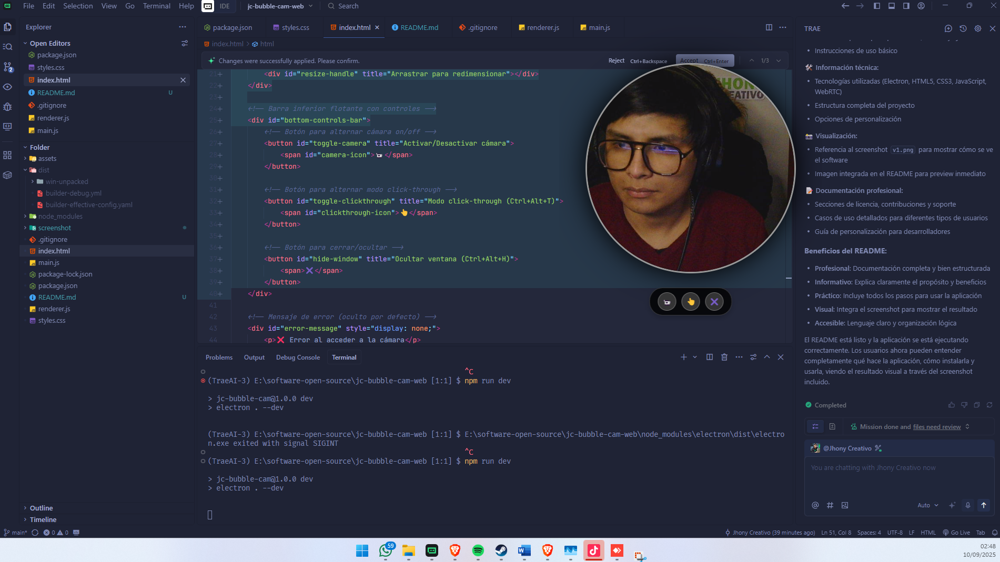

# JC Bubble Cam Web 📹

Una aplicación de escritorio minimalista que convierte tu cámara web en una burbuja flotante elegante y siempre visible.


## 🎯 ¿Para qué sirve?

**JC Bubble Cam Web** es perfecta para:

- **Videollamadas profesionales**: Mantén tu imagen visible mientras trabajas en otras aplicaciones
- **Streaming y contenido**: Superpón tu cámara sobre cualquier contenido sin interferir
- **Monitoreo personal**: Verifica tu apariencia antes de reuniones importantes
- **Grabación de tutoriales**: Mantén tu presencia visible mientras enseñas
- **Trabajo remoto**: Permanece "presente" visualmente durante largas sesiones de trabajo

## ✨ Características principales

### 🔄 **Doble tamaño adaptable**
- **Doble clic**: Expande la burbuja al doble de tamaño (200px → 400px)
- **Doble clic nuevamente**: Regresa al tamaño original
- **Transición suave**: Animación fluida de 0.5 segundos

### 🎮 **Controles inteligentes**
- **Barra flotante adaptativa**: Se reposiciona automáticamente según el tamaño de la burbuja
- **Hover para mostrar**: Los controles aparecen al pasar el mouse
- **Botones intuitivos**: Ocultar, cerrar y configuraciones

### 🖱️ **Interacción fluida**
- **Arrastrar libremente**: Mueve la burbuja a cualquier parte de la pantalla
- **Siempre encima**: Permanece visible sobre todas las aplicaciones
- **Ventana sin bordes**: Diseño limpio y minimalista

### 🎨 **Diseño elegante**
- **Forma circular perfecta**: Burbuja con bordes redondeados
- **Efectos visuales**: Sombras suaves y transiciones animadas
- **Interfaz moderna**: Controles con iconos y efectos hover

## 🚀 Instalación y uso

### Prerrequisitos
- Node.js (versión 14 o superior)
- npm o yarn
- Cámara web funcional

### Instalación

```bash
# Clonar el repositorio
git clone https://github.com/tu-usuario/jc-bubble-cam-web.git

# Navegar al directorio
cd jc-bubble-cam-web

# Instalar dependencias
npm install

# Ejecutar la aplicación
npm start
```

### Uso básico

1. **Iniciar**: Ejecuta `npm start` para abrir la burbuja de cámara
2. **Posicionar**: Arrastra la burbuja donde prefieras en tu pantalla
3. **Expandir**: Haz doble clic para agrandar la vista
4. **Contraer**: Haz doble clic nuevamente para volver al tamaño normal
5. **Controles**: Pasa el mouse sobre la burbuja para ver las opciones

## 🛠️ Tecnologías utilizadas

- **Electron**: Framework para aplicaciones de escritorio
- **HTML5**: Estructura y acceso a la cámara web
- **CSS3**: Estilos, animaciones y efectos visuales
- **JavaScript**: Lógica de interacción y controles
- **WebRTC**: API para acceso a la cámara

## 📁 Estructura del proyecto

```
jc-bubble-cam-web/
├── assets/
│   ├── icon.ico          # Icono de la aplicación
│   └── icon.png          # Icono en formato PNG
├── screenshot/
│   └── v1.png            # Captura de pantalla
├── index.html            # Interfaz principal
├── main.js               # Proceso principal de Electron
├── renderer.js           # Lógica del renderizador
├── styles.css            # Estilos y animaciones
├── package.json          # Configuración del proyecto
└── README.md             # Este archivo
```

## 🎯 Casos de uso ideales

### Para profesionales
- **Reuniones virtuales**: Mantente visible mientras compartes pantalla
- **Presentaciones**: Superpón tu imagen sobre diapositivas
- **Consultas online**: Interacción cara a cara con clientes

### Para creadores de contenido
- **Streaming**: Cámara flotante sobre juegos o aplicaciones
- **Tutoriales**: Presencia personal en videos educativos
- **Podcasts con video**: Vista compacta del presentador

### Para uso personal
- **Trabajo remoto**: "Presencia" visual durante el día
- **Monitoreo**: Verificar apariencia antes de videollamadas
- **Multitarea**: Cámara visible mientras usas otras apps

## 🔧 Personalización

La aplicación es fácilmente personalizable:

- **Tamaños**: Modifica las dimensiones en `styles.css`
- **Colores**: Cambia la paleta de colores y efectos
- **Controles**: Añade nuevos botones y funcionalidades
- **Animaciones**: Ajusta las transiciones y efectos

## 📝 Licencia

Este proyecto está bajo la Licencia MIT. Consulta el archivo `LICENSE` para más detalles.

## 🤝 Contribuciones

Las contribuciones son bienvenidas. Por favor:

1. Fork el proyecto
2. Crea una rama para tu feature (`git checkout -b feature/AmazingFeature`)
3. Commit tus cambios (`git commit -m 'Add some AmazingFeature'`)
4. Push a la rama (`git push origin feature/AmazingFeature`)
5. Abre un Pull Request

## 📞 Soporte

Si tienes problemas o sugerencias:

- Abre un [Issue](https://github.com/tu-usuario/jc-bubble-cam-web/issues)
- Contacta al desarrollador
- Revisa la documentación

---

**JC Bubble Cam Web** - Convierte tu cámara en una experiencia flotante elegante y funcional. 🎥✨